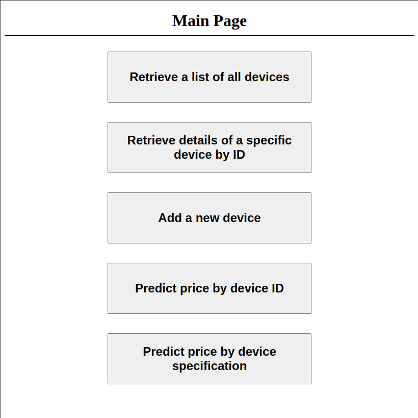

# Devices Price Classification System

## Overview

This project implements a Devices Price Classification System consisting of two main components:

1. Python project: Predicts device prices based on their specifications.
2. SpringBoot project: Provides RESTful API endpoints to interact with the Python project and store predicted prices in a database.

## Project Structure

The project is organized into three main directories:

- **Python**: Contains the Python implementation.
- **SpringBoot**: Contains the Spring Boot implementation.
- **Database**: Contains the sqlite database.

## Python Project

### Files
- **app.py**: Main Python application file.
- **EDA.ipynb**: Jupyter notebook for exploratory data analysis (EDA).
- **processed_test_data.csv**: Processed test dataset.
- **processed_train_data.csv**: Processed train dataset.
- **templates/index.html**: HTML template for visualization.
- **test-test.csv**: Test dataset in CSV format.
- **test.xlsx**: Test dataset in Excel format.
- **train-train.csv**: Train dataset in CSV format.
- **train.xlsx**: Train dataset in Excel format.
- **xgb_model.pkl**: Pickled XGBoost model.
- **XGBoost.ipynb**: Jupyter notebook for XGBoost model training.

### Usage
1. Ensure Python and required libraries are installed.
2. Run `app.py` to start the application.
3. Access the API endpoints for predictions.

-API can be used alone without springboot, through HTTP calls.
  to accsses it alone use [http://localhost:5000/](http://localhost:5000/).

### Exploratory Data Analysis
- Explore the dataset and insights using the `EDA.ipynb` notebook.

### Model Description

We utilized XGBoost, a supervised Ensemble Learning Algorithm, for our price prediction model. 

#### Data Splitting

During the model training phase, we split our train data into three subsets using an 80/10/10 ratio:
- 80% for training
- 10% for validation
- 10% for testing

In the initial implementation, we did not perform a separate split for testing as we did not compare our model to others. 

However, this setup allows for future model comparisons and evaluations.

### Evaluation Metrics

- Accuracy on Validation Set: 91.5%
- Accuracy on Test Set: 90.5%

Classification Report:
              precision    recall  f1-score   support

           0       0.96      0.96      0.96        46
           1       0.85      0.92      0.88        49
           2       0.92      0.80      0.85        55
           3       0.91      0.96      0.93        50

     accuracy                           0.91       200
     macro avg       0.91      0.91      0.91       200
     weighted avg       0.91      0.91      0.90       200

### Retraining the Model
- You can retrain the model by running the `XGBoost.ipynb` Jupyter notebook.
- The model was initially trained using the following hyperparameters: 
  - Best Parameters:
    - `gamma`: 0.2
    - `importance_type`: 'gain'
    - `learning_rate`: 0.1
    - `max_delta_step`: 1
    - `max_depth`: 3
    - `min_child_weight`: 3
    - `n_estimators`: 300
    - `reg_lambda`: 0.1

## SpringBoot Project

### Files Overview

- **src/main/java/com/example/Devices**: This directory contains all the core Java source code for the application.
    - **com/example/Devices/Controller**: Java classes implementing controllers for handling user requests.
    - **com/example/Devices/DTO**: Data Transfer Objects (DTOs) used for defining data structures exchanged between layers.
    - **com/example/Devices/Entity**: Entity classes representing the data model.
    - **com/example/Devices/Repository**: Repository interfaces for interacting with the persistence layer (likely a database).
- **AppConfig.java**: Configuration class for the application.
- **DevicesApplication.java**: The main Spring Boot application class.

- **src/main/resources**: This directory holds various resource files used by the application.
    - **application.properties**: Configuration properties for the application.
    - **static**: This subdirectory contains static assets like HTML files used for the user interface.
        - **index.html**: Main page.
        - **predict_by_specification.html**: Predict price range by manually entered specifications.
        - **predict_price_by_id.html**: Predict price range by using the ID of already existing data.
        - **retrieve_all_devices.html**: Show all devices in the database.
        - **retrieve_device_details_by_ID.html**: Show device specification by its ID.

- **../Database/database.db**: sqlite database used for storing data

### Usage
1. Navigate to the SpringBoot directory.
2. Build the project: `mvn clean install`.
3. Run it using: `mvn spring-boot:run`.

### Endpoints
- `GET /api/devices/`: Retrieve a list of all devices.
- `GET /api/devices/{id}`: Retrieve details of a specific device by ID.
- `POST /api/devices/`: Add a new device.
- `POST /api/predict/{deviceId}`: Predict the price for a device.

## Running the Applications

- Ensure you have suitable dependencies installed.
- Start the Python application by navigating to its directory and running `app.py`.
- Start the SpringBoot application (as mentioned in the usage section above).
- Access the main page through: [http://localhost:5000/](http://localhost:8080/)

 

## Database

Dataset columns are as follows:
- id: Device ID in the database.
- Battery Power: Total energy a battery can store in one time measured in mAh
- Has Bluetooth: Has Bluetooth or not
- Clock Speed: The speed at which the microprocessor executes instructions
- Dual Sim: Has dual sim support or not
- Front Camera MP: Front Camera megapixels
- Has 2G/3G/4G: Has 4G, 3G, or 2G
- Internal Memory: Internal Memory in Gigabytes
- Mobile Depth: Mobile Depth in cm
- Mobile Weight: Weight of mobile phone
- Number of Cores: Number of cores of the processor
- Primary Camera MP: Primary Camera megapixels
- Pixel Density: Pixel Resolution ('px_height' * 'px_width' / 'screen_size').
- RAM: Random Access Memory in Megabytes
- diagonalScreenSize: sqrt('sc_h'**2 + 'sc_w'**2)
- Talk Time: longest time that a single battery charge will last when you are
- Has Touch Screen: Has touch screen or not
- Has WiFi: Has wifi or not

- Price Range: This is the target variable with the value of:
  - 0 (low cost)
  - 1 (medium cost)
  - 2 (high cost)
  - 3 (very high cost)
